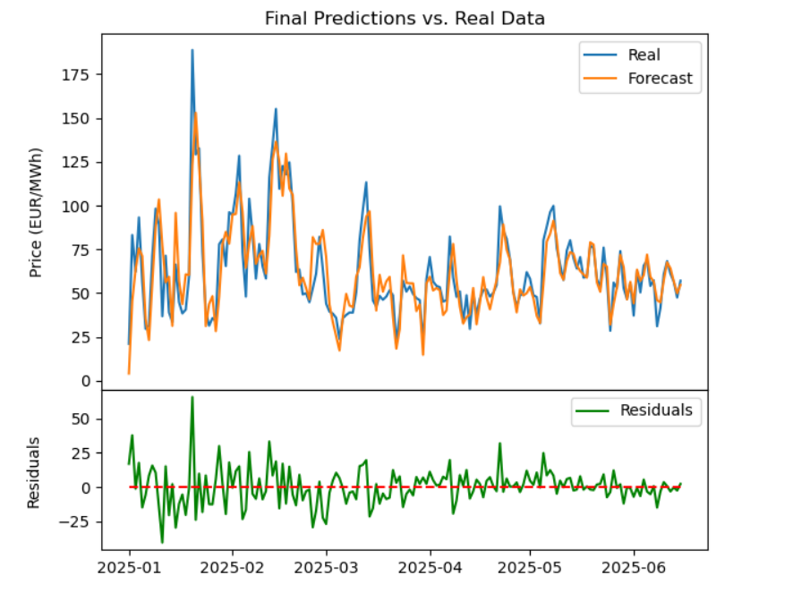

# NO2 Day-Ahead Electricity Price Forecasting

This project forecasts **day-ahead electricity prices** in the NO2 bidding zone of Nord Pool using a hybrid approach that combines **machine learning** with **time series modelling**. 

The goal is to improve predictive accuracy for energy trading and portfolio optimisation through statistical analysis of exogenous drivers (weather, fuel markets, power prices in interconnected regions), and the autocorrelated structure of electricity prices.

The model achieved a **mean absolute error (MAE) of ~9.5 EUR/MWh**.



---

## 📊 Project Overview

Electricity spot prices are volatile, influenced by a wide range of fundamental and stochastic factors, from fuel costs to weather conditions, from renewable output to cross-border flows.  

This project implements a **hybrid modelling approach**:

1. **Machine Learning Base Regressor**  
   - Trains on exogenous features (weather, fuel prices, power prices of neighbours, reservoir levels).  

2. **SARIMA Residual Correction**  
   - Models the temporal structure of residuals to capture autocorrelation and seasonality.
   - Shaves down forecasting errors left over from the ML stage.  


## ⚡ Data Sources

The model integrates data from **public sources**:

- **Nord Pool** - day-ahead prices and market data for Scandinavian and other European regions
- **Yahoo Finance (yfinance)** - commodity prices e.g. TTF gas 
- **Frost API (Norwegian Meteorological Institute)** - weather forecasts (wind, temperature, precipitation).  
- **Ember** - price data for countries not traded on Nord Pool e.g. for the UK, which is traded on EPEX SPOT.  
- **ENTSOe** - water levels of Norwegian reservoirs.

N.B. Frost API requires a client ID to gain access. This key should be saved in a .env file in the project root directory in the format: 
```
FROST_CLIENT_ID=your-client-id. 
```
Note that quotes "" should not be placed around your-client-id.


## 🔬 Methods

- **Feature Engineering & Analysis**  
  - **Correlation cluster maps** and **VIF** to analyse multicollinearity structure.  
  - **Mutual Information** to assess predictive strength of features.  
  - **PCA** for dimensionality reduction and handling collinearity.

- **Modelling**  
  - Base ML models (e.g. linear/ridge/lasso regression, ensemble methods).  
  - Residual correction via **SARIMA** time series models.  

- **Performance**  
  - Achieved **MAE ≈ 9.5 EUR/MWh** on day-ahead NO2 price forecasts.  


## ⚙️ Example Workflow

1. Collect and preprocess raw data from APIs and web scrapers.  
2. Perform statistical analysis to select informative features.  
3. Train ML regressor on exogenous features.  
4. Apply SARIMA to residuals for temporal correction.  
5. Evaluate performance (MAE, RMSE, visual forecast comparisons).  


## 🚀 Future Improvements

- Extend model to **multi-bidding zone predictions** across Nord Pool. 
- Incorporate other regressors such as **cross-border flow data** and **interconnector capacity constraints** for a more detailed picture.
- Explore **jump-diffusion models** to address price spikes.
- Implement **dynamic weighting** between ML and SARIMA outputs. 
- Automate daily retraining with live data feeds.  


## 🛠️ Tech Stack

- **Python** — data processing & modelling  
- **pandas, numpy, scikit-learn, statsmodels** — ML + time series  
- **matplotlib, seaborn** — visualisation  
- **yfinance, requests, Frost API** — data collection


## 📂 Repository Structure

```text
Project Root
├── data/ 					# Datasets not directly imported from online sources 
│ ├── EU_daily_price_data_Ember.csv		# For UK price data (not on Nord Pool)
│ └── Water_Reservoir_Filling_Data_entsoe.csv	# Norwegian reservoir data from ENTSOe
│
├── data_import_functions/ 			# All data extraction modules - includes cleaning, aggregation and formatting
│
├── notebooks/ 				# Walkthroughs of analysis and regression methodology
│ ├── data_gathering.ipynb			# Reasoning behind selecting each exogenous variable and explanation of preprocessing
│ ├── statistical_analysis.ipynb		# Disentangling regressors and dealing with multicollinearity
│ └── ML_SARIMA_regression.ipynb		# Training hybrid ML/SARIMA model to forecast day-ahead prices
│
├── config.py					# Configure project pathways
│
├── requirements.txt 				# Minimal dependencies
└── README.md 					# This file

```

